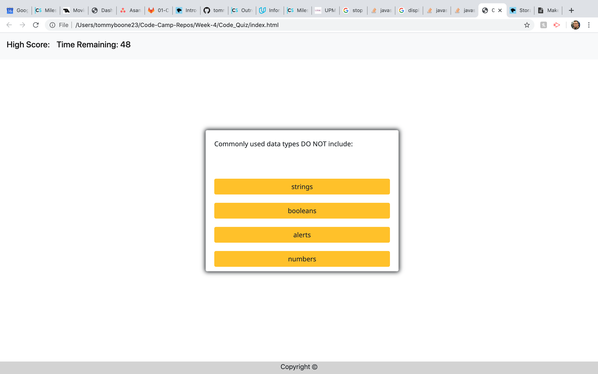

# Code_Quiz

This app was made using Bootstrap CDN and dynamic HTML elements created mostly in the questions.js file

# Usage

The user arrives at the landing page and is presented with a call-to-action to "Start Quiz." Also note the navigation option to "View Highscores" and the "Time" value set at 0.

Clicking the "Start Quiz" button presents the user with a series of questions. The timer is initialized with a value of 60 and immediately begins countdown.

Score is calculated by time remaining. Answering quickly and correctly results in a higher score. Answering incorrectly results in a time penalty of 15 seconds per wrong answer.

When time runs out and/or all questions are answered, the user is presented with their final score and asked to enter their initials. Their final score and initials are then stored in localStorage.

# Screenshot

 